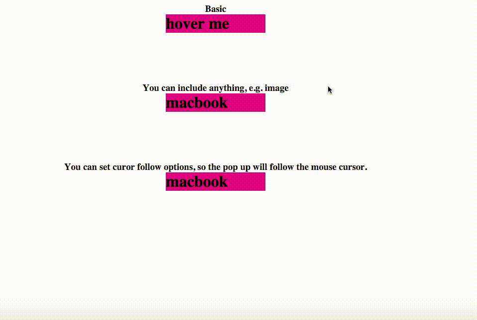

# React hover --- hover anything. ( Tooltip, div components...)
[](https://gitter.im/cht8687/help)




## Installation

### npm

```
$ npm install --save react-hover
```

## Demo

[Demo](http://cht8687.github.io/react-hover/example/)

## Example code

[Code Example](https://github.com/cht8687/react-hover/blob/master/src/example/Example.js)


## Usage

```js
<ReactHover
    styles={styles.basic}
    componentHtml={componentHtml.basicComponentHtml}
    options={optionsCursorFalse}
/>

```
## Options

#### `styles`: PropTypes.object.isRequired

```js
export const styles = {
  trigger: {
    background: '#E0037E',
    width: '200px',
    margin: '0 auto'
  },

  hoverComponent: {
    height: '200px',
    overflowY: 'auto',
    outline: '1px solid blue',
    width: '300px',
    background: '#E8E27E',
    display: 'none',
    position: 'absolute',
    margin: '-20px 0 0 717px'
  }
};
```
`trigger` object is for the style of trigger component. 
`hoverComponent` is for hover object.
You can modify the css to anything to fit your needs. In other words, the whole styles are flexible.

**Note that you can use other module system instead of ES6 for exporting this object.

1.You can turn anything into hover component.
2.You can adjust CSS to make hover component show in any position.


#### `componentHtml`: PropTypes.object.isRequired

```js
export const componentHtml = {
  hoverComponent: '<h1> pop up header </h1> <p> pop up content </p>',
  trigger: 'hover me'
};

```
`componentHtml` contains the html code which you'd like to display.
`trigger` object can receive `mouseOver` event and once triggered, the `hoverComponent` will show up.

#### `options`: PropTypes.object.isRequired

Set the options.

```js

const options = {
  followCursor:true,
  shiftX: 20,
  shiftY: 0
}

```
`followCursor`: define if hover object follow mouse cursor
`shiftX`: left-right shift the hover object to the mouse cursor
`shiftY`: up-down shift the hover object to the mouse cursor


## Development

```
$ git clone git@github.com:cht8687/react-hover.git
$ cd react-listview-sticky-header
$ npm install
$ webpack-dev-server
```

Then

```
open http://localhost:8080/webpack-dev-server/
```

## License

MIT
